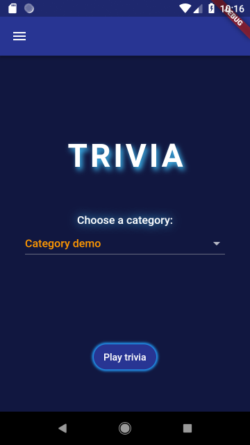
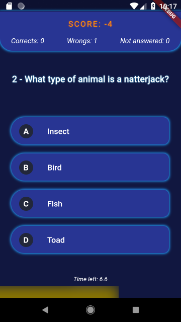
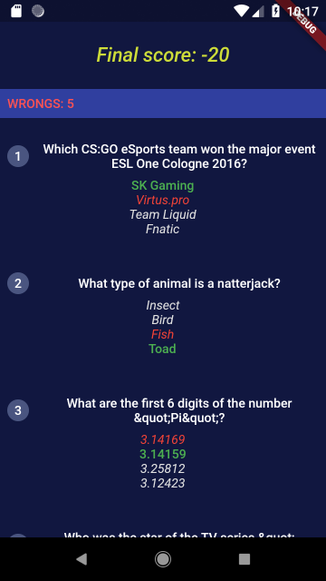
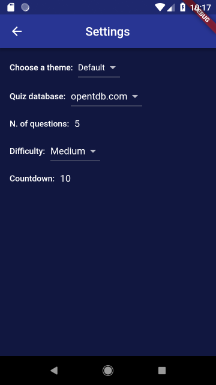

# Trivia game example

A simple trivia game using the [frideos](https://pub.dartlang.org/packages/frideos) package.

**features**:

- State management
- Streams and BLoC pattern
- Dynamic theme changer
- Settings page
- Switchable quiz API (mock questions or quiz from https://opentdb.com/)
- Json data (fetching and parsing)
- Animations
- Text shadows

### Packages used:

- [Frideos-flutter](https://pub.dartlang.org/packages/frideos)

## Screenshots

